# 标注数据概览

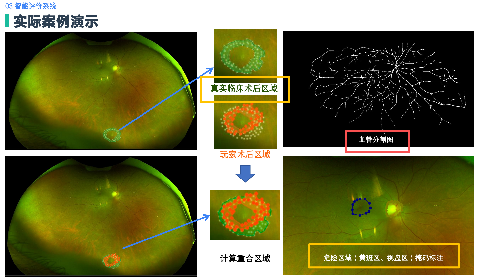

* 血管分割图(红框)：使用**vesselme** 标注
* 真实临床术后区域 ：使用**labelme** 标注

# 使用vesselme标注血管分割图

## 标注对象

每一组样本里的: **[患者编号]_before_[一些其他标记]_reg.png**

## 软件下载地址

https://github.com/EricFeng9/vesselme

## 软件安装

见根目录下的README.md 不会的可以问ai帮忙

## 运行环境

macOS,Windows,Linux均可(但是要带图形化界面的Linux)

## 标注流程

### 软件界面介绍

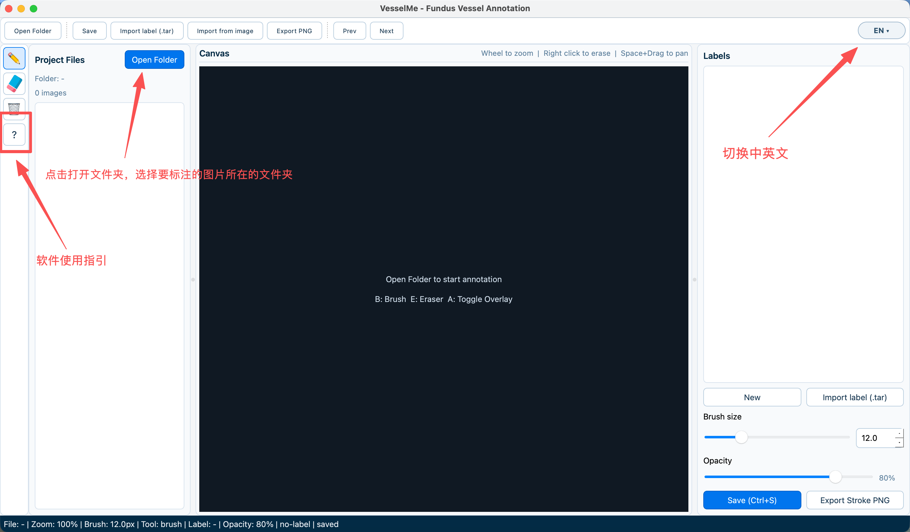

### 标注步骤

==注意：这里的label的命名统一使用**label1**==

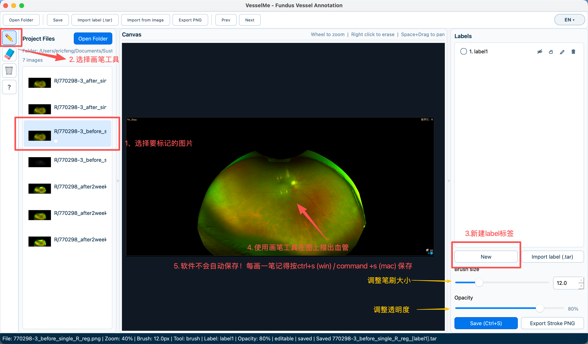

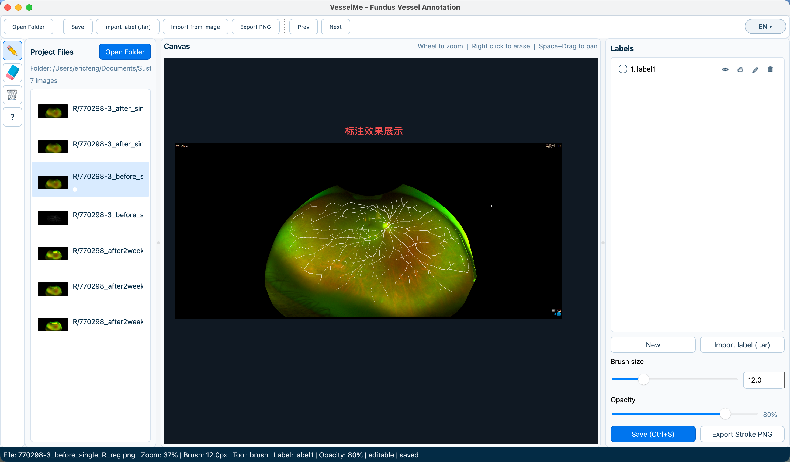

### 血管标注要求

* 光凝时理论上尽量避开血管，需要标注大血管，主要是三级血管。过于细小血管可不标注

* 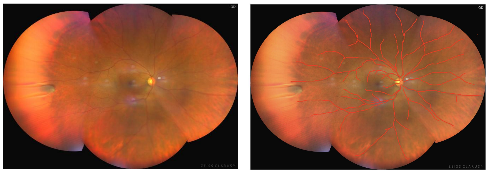

  参考资料

  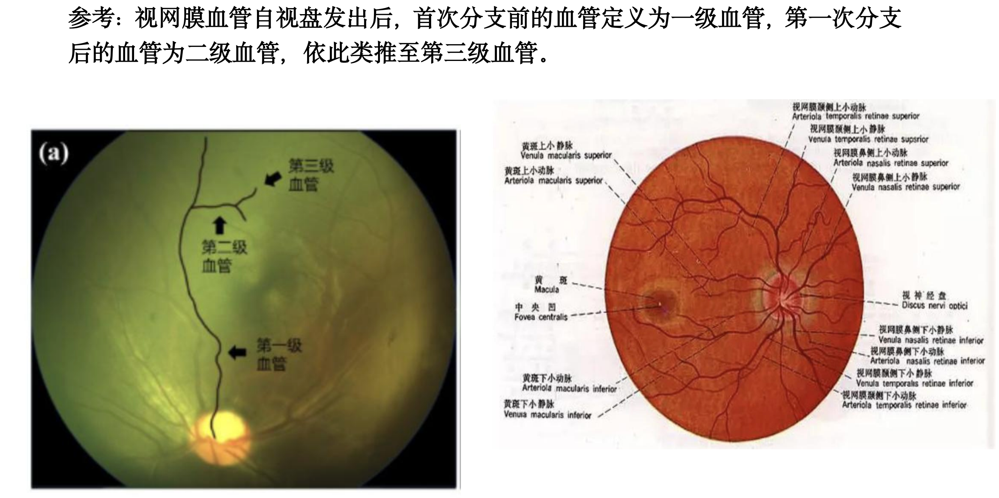

### 标注后检查

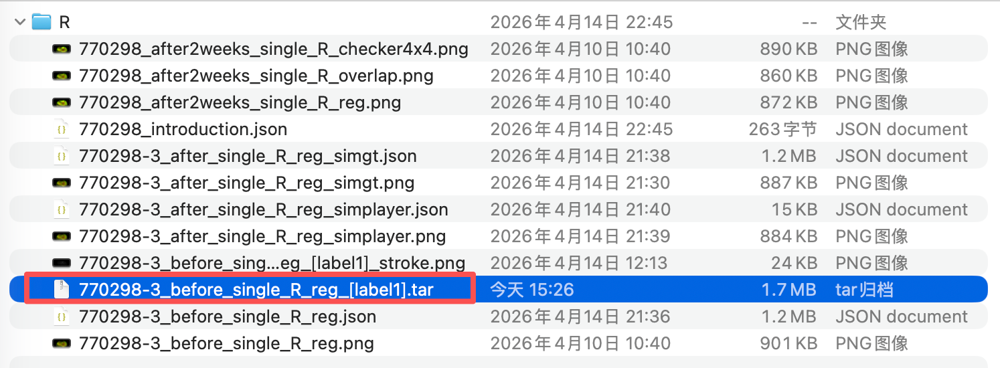

保存标注后应该会在图片同级目录下生成一个跟图片同名的，后缀为_[label1].tar的文件，提交前请确认是否有该文件

# 使用labelme标注黄斑、视盘区域危险区

## 标注对象

每一组样本里的: **[患者编号]_before_[一些其他标记]_reg.png**

## 软件安装

1. 创建一个新的conda环境命名为labelme（推荐）

2. 激活刚刚创建的conda环境，运行`pip install labelme `

3. 安装完后，直接在控制台输入`labelme`即可打开

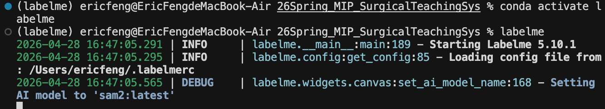

## 标注流程

### 标注步骤

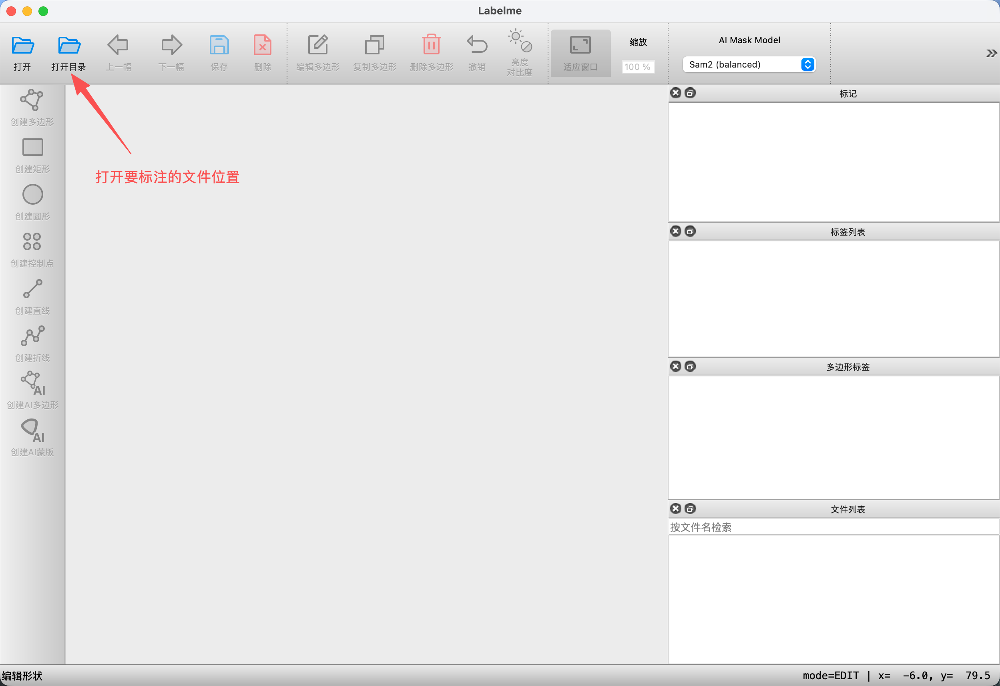

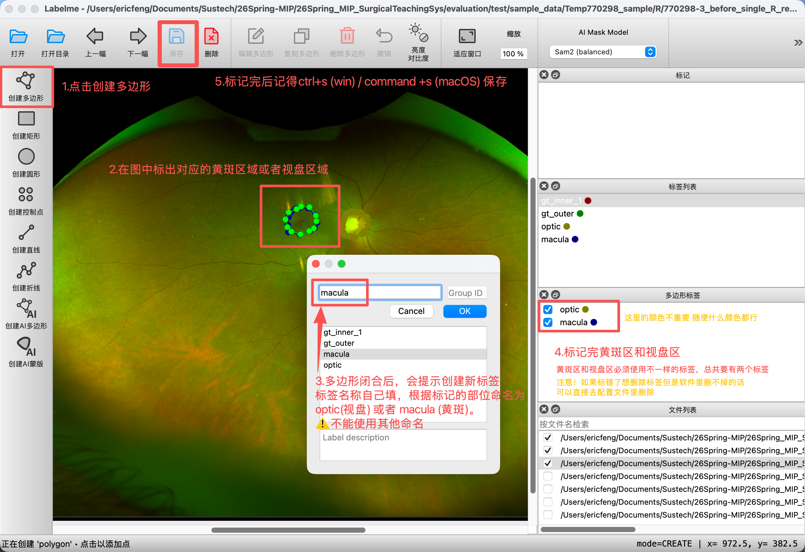

### 危险区标注要求

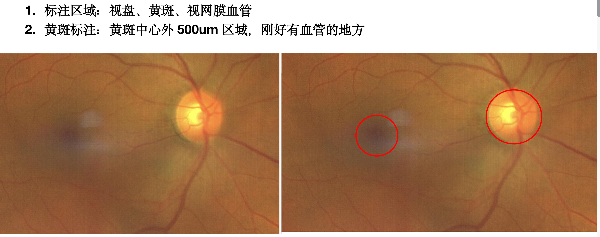

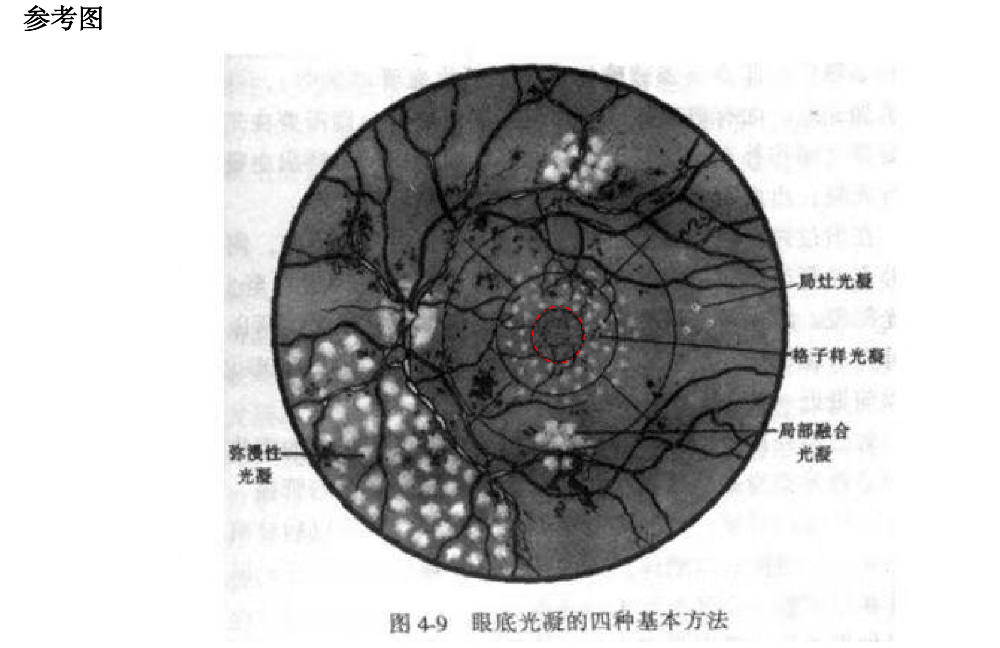

### 标注后检查

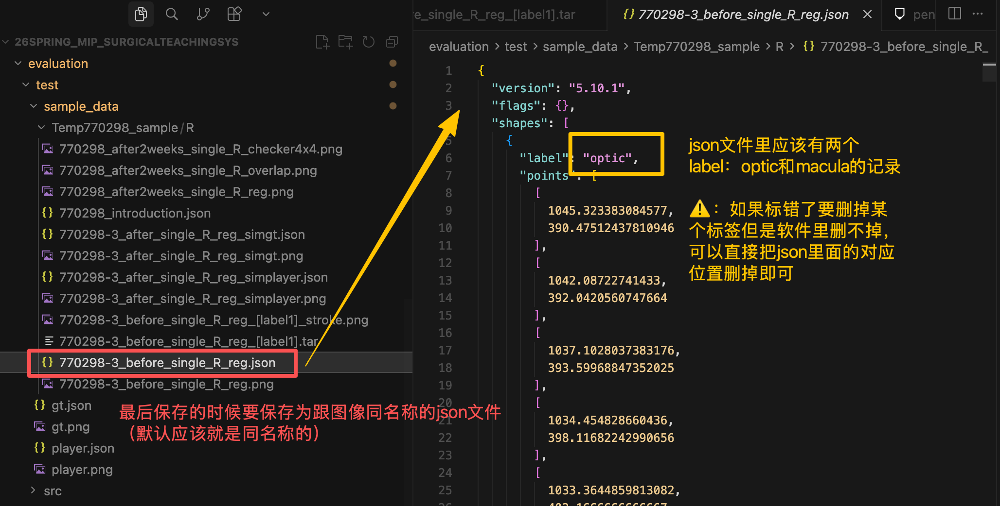

## 验收标准

最后发给我的文件中对于**每张要标注的图片**要有如下三个文件：

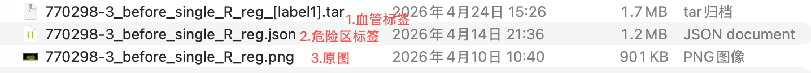